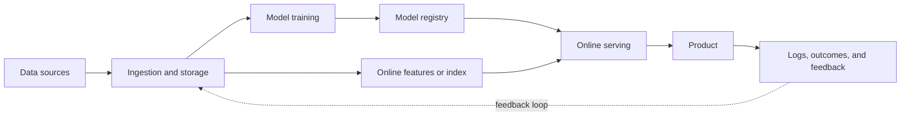
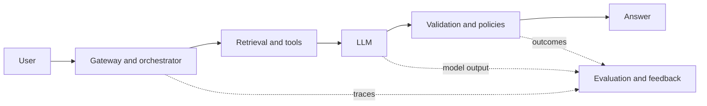

# 00 — Study Plan and Interview Strategy

## What the interview tests

AI Systems Design is not cloud-service trivia. It tests whether you make sound decisions when data, models, software, and users interact under real constraints.

Interviewers look for evidence that you can:

- discover the product problem, user, decision, and potential harm;
- formulate it as an ML task with labels, features, horizon, and baseline;
- design acquisition, training, deployment, serving, feedback, and observability;
- quantify traffic, data, latency, freshness, availability, compute, and cost;
- add complexity only for an explicit requirement;
- operate through drift, incidents, regressions, abuse, and partial failure;
- communicate assumptions and revise the design as requirements change.

## Layers of a strong answer

| Layer      | Central question                | Common mistake               |
|------------|---------------------------------|------------------------------|
| Product    | What value, for whom?           | Starting with a model        |
| Metrics    | How is success known?           | Using only accuracy          |
| Data       | What exists at prediction time? | Leakage or biased labels     |
| Modeling   | What baseline and trade-off?    | Choosing the fanciest model  |
| System     | How does output reach the user? | Ignoring peaks and failure   |
| Lifecycle  | How does it improve safely?     | Training once and forgetting |
| Risk       | How does it fail safely?        | Adding safety at the end     |
| Operations | Who detects and fixes it?       | “Monitoring” without action  |

## A 45-minute script

### Minutes 0–5: clarify

Ask only questions that change the design:

- Who consumes the output, and what action follows?
- Is this prediction, ranking, generation, detection, or automation?
- Is it advisory or autonomous?
- What are the costs of false positives and false negatives?
- What p50/p95/p99 latency, availability, and freshness are required?
- What is current and expected scale? Global or regional?
- What data exists, and what privacy/legal constraints apply?
- Can we collect explicit or implicit feedback?

State assumptions explicitly: “I will assume X. If that changes, I would change Y.”

### Minutes 5–10: contract and scale

Define exact input/output, business metric, offline proxy, online metric, guardrails, SLO, and order-of-magnitude capacity.

### Minutes 10–20: high-level architecture

For GenAI:

### Minutes 20–35: deep dives

Choose two or three high-risk areas: label leakage, retrieval/ranking, feature parity, tail latency, LLM evaluation, authorization, or multi-tenancy. Depth beats a shallow catalog.

### Minutes 35–42: failures and operations

For each hop ask: What if it is slow, down, stale, or wrong? Is retry safe? What fallback preserves value? What triggers rollback? Can an operator trace the request to exact model, data, and configuration versions?

### Minutes 42–45: summarize and evolve

Restate the architecture, central trade-offs, risks, and phased path:

- V0: rules, manual process, or simple baseline;
- V1: simple model with instrumentation;
- V2: personalization, streaming, or stronger model only when evidence supports it.

## Fourteen-day plan

| Day | Topic                       | Deliverable                       |
|-----|-----------------------------|-----------------------------------|
| 1   | Framework and clarification | Three product contracts           |
| 2   | Estimation and SLOs         | Five capacity exercises           |
| 3   | Labels, leakage, splits     | Audit an imaginary dataset        |
| 4   | Features                    | Design offline/online parity      |
| 5   | Training and experiments    | Pipeline and promotion gates      |
| 6   | Serving and caches          | Designs at 1k and 100k QPS        |
| 7   | Recommendation/search       | Timed full case                   |
| 8   | RAG                         | Pipeline with ACLs and citations  |
| 9   | LLM serving and agents      | Token budget and failure analysis |
| 10  | Evaluation/monitoring       | Dashboard and runbook             |
| 11  | Safety/privacy/fairness     | Threat model one case             |
| 12  | MLOps/cost                  | Build-vs-buy and GPU capacity     |
| 13  | Two mock interviews         | Record and score both             |
| 14  | Review                      | Cheat sheet and weak areas        |

For a three-day sprint: study 01–04 and solve recommendation; study 05–07 and solve enterprise RAG; then run one ML and one GenAI mock without notes.

## Scoring rubric: 0–2 each

Score requirements, metrics, scale, data, model, serving, evaluation, operations, risk, and communication. A 2 means requirements are explicit, numbers drive decisions, baselines and trade-offs are defended, failures have fallbacks, and alerts have actions. Target at least 16/20 with no zero.

## Useful phrases

- “Before choosing a model, I want to fix the user action and cost of each error.”
- “This is an order-of-magnitude estimate; I will use it to decide whether sharding is needed.”
- “I would start with this baseline because it creates an operable reference and feedback loop.”
- “Offline quality is a proxy; I would confirm causal impact with an online experiment.”
- “If this dependency fails, we serve a lower-quality fallback within the SLO.”

## Anti-patterns

- Drawing microservices before defining the product.
- Claiming exactly-once without idempotency, deduplication, or transactions.
- Using accuracy for a rare class or random splits for temporal data.
- Adding streaming or a feature store merely to sound senior.
- RAG without document authorization or retrieval evaluation.
- Fine-tuning to store frequently changing knowledge.
- Optimizing a reward model and mistaking it for true behavior (reward hacking).
- Planning LLM capacity by QPS while ignoring KV-cache memory and prefill-vs-decode.
- Auto-scaling without cold starts, quotas, or model-load time.
- Unlimited retries and alerts without owner or action.
