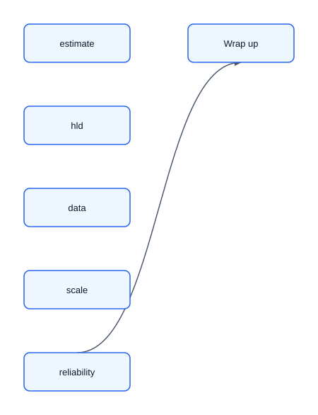
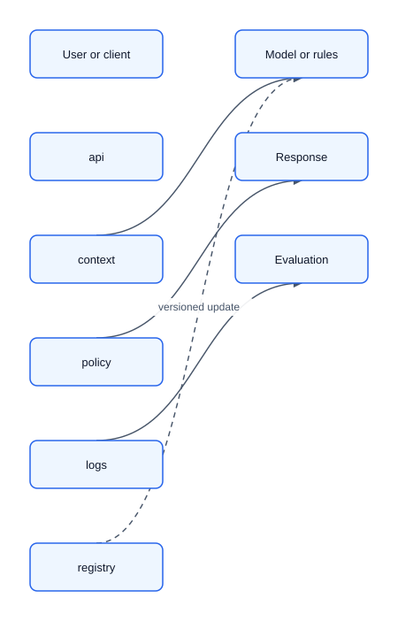

# 00 — Study Plan and Interview Strategy

## What the interview tests

AI Systems Design is not cloud-service trivia. It tests whether you make sound decisions when data, models, software, and users interact under real constraints.

Interviewers look for evidence that you can:

- discover the product problem, user, decision, and potential harm;
- formulate it as an ML task with labels, features, horizon, and baseline;
- design acquisition, training, deployment, serving, feedback, and observability;
- quantify traffic, data, latency, freshness, availability, compute, and cost;
- add complexity only for an explicit requirement;
- operate through drift, incidents, regressions, abuse, and partial failure;
- communicate assumptions and revise the design as requirements change.

## Layers of a strong answer

| Layer      | Central question                | Common mistake               |
|------------|---------------------------------|------------------------------|
| Product    | What value, for whom?           | Starting with a model        |
| Metrics    | How is success known?           | Using only accuracy          |
| Data       | What exists at prediction time? | Leakage or biased labels     |
| Modeling   | What baseline and trade-off?    | Choosing the fanciest model  |
| System     | How does output reach the user? | Ignoring peaks and failure   |
| Lifecycle  | How does it improve safely?     | Training once and forgetting |
| Risk       | How does it fail safely?        | Adding safety at the end     |
| Operations | Who detects and fixes it?       | “Monitoring” without action  |

## A ByteByteGo-style 45-minute script

Use the same loop for every case. The first diagram is the interview flow; the second is the default AI system shape to start from after requirements are clear.

### Step 1: understand the problem and establish scope

Spend 5-8 minutes asking questions that change the design:

- Who uses the output, and what decision or action follows?
- Is this prediction, ranking, generation, detection, summarization, or automation?
- Is the system advisory, semi-automated, or autonomous?
- What are the costs of false positives, false negatives, bad answers, or unsafe actions?
- What p95/p99 latency, availability, freshness, privacy, and budget constraints matter?
- What current scale and one-year growth should the design support?
- What data exists at decision time, and what feedback can be logged?

End this step with a tight contract: input, output, success metric, guardrails, scale, and out-of-scope items.

### Step 2: propose a high-level design and get buy-in

Spend 10-15 minutes drawing the simplest end-to-end flow. Include the user/client, API or orchestrator, data/retrieval path, model or rules, policy layer, response, logs, and a basic training or evaluation loop. Do back-of-the-envelope math only to decide whether the simple blueprint fits.

Keep the diagram boring on purpose. Table optimizations such as streaming, sharding, multi-region active-active, graph models, or fine-tuning until the interviewer agrees they are needed.

### Step 3: design deep dive

Spend 15-20 minutes on two or three components selected from the actual requirements. Common AI deep dives are label quality, point-in-time features, retrieval quality, latency budget, cost controls, permission checks, evaluation, and rollout.

### Step 4: wrap up

Spend 3-5 minutes summarizing trade-offs, bottlenecks, failure handling, and the next scale step. Close with a phased path:

- V0: rules, manual process, BM25, popularity, or another simple baseline.
- V1: simple model or RAG path with logging, evaluation, canary, and rollback.
- V2: streaming, ANN tuning, personalization, fine-tuning, agents, or multi-region only after a measurable trigger.

## Fourteen-day plan

| Day | Topic                       | Deliverable                       |
|-----|-----------------------------|-----------------------------------|
| 1   | Framework and clarification | Three product contracts           |
| 2   | Estimation and SLOs         | Five capacity exercises           |
| 3   | Labels, leakage, splits     | Audit an imaginary dataset        |
| 4   | Features                    | Design offline/online parity      |
| 5   | Training and experiments    | Pipeline and promotion gates      |
| 6   | Serving and caches          | Designs at 1k and 100k QPS        |
| 7   | Recommendation/search       | Timed full case                   |
| 8   | RAG                         | Pipeline with ACLs and citations  |
| 9   | LLM serving and agents      | Token budget and failure analysis |
| 10  | Evaluation/monitoring       | Dashboard and runbook             |
| 11  | Safety/privacy/fairness     | Threat model one case             |
| 12  | MLOps/cost                  | Build-vs-buy and GPU capacity     |
| 13  | Two mock interviews         | Record and score both             |
| 14  | Review                      | Cheat sheet and weak areas        |

For a three-day sprint: study 01–04 and solve recommendation; study 05–07 and solve enterprise RAG; then run one ML and one GenAI mock without notes.

## Scoring rubric: 0–2 each

Score requirements, metrics, scale, data, model, serving, evaluation, operations, risk, and communication. A 2 means requirements are explicit, numbers drive decisions, baselines and trade-offs are defended, failures have fallbacks, and alerts have actions. Target at least 16/20 with no zero.

## Useful phrases

- “Before choosing a model, I want to fix the user action and cost of each error.”
- “This is an order-of-magnitude estimate; I will use it to decide whether sharding is needed.”
- “I would start with this baseline because it creates an operable reference and feedback loop.”
- “Offline quality is a proxy; I would confirm causal impact with an online experiment.”
- “If this dependency fails, we serve a lower-quality fallback within the SLO.”

## Anti-patterns

- Drawing microservices before defining the product.
- Claiming exactly-once without idempotency, deduplication, or transactions.
- Using accuracy for a rare class or random splits for temporal data.
- Adding streaming or a feature store merely to sound senior.
- RAG without document authorization or retrieval evaluation.
- Fine-tuning to store frequently changing knowledge.
- Optimizing a reward model and mistaking it for true behavior (reward hacking).
- Planning LLM capacity by QPS while ignoring KV-cache memory and prefill-vs-decode.
- Auto-scaling without cold starts, quotas, or model-load time.
- Unlimited retries and alerts without owner or action.
