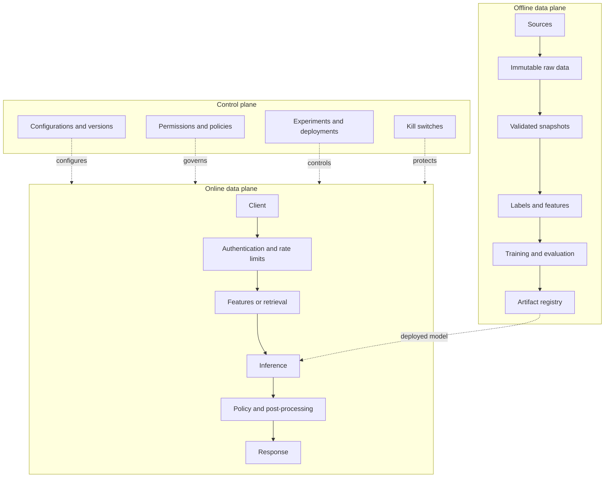

# 01 — Universal Design Framework and Estimation

## 1. Turn the idea into a contract

Before drawing, fill in:

```text
User and decision:
Prediction/generation unit:
Input available at that instant:
Output and how it is consumed:
Business goal and cost of harm:
Latency, availability, freshness:
Volume and growth:
Privacy, region, explainability, budget:
Out of scope:
```

Fraud example: score one transaction during authorization; approve, challenge, or decline; p99 below 100 ms; fraud loss competes with false-decline cost.

## 2. Build a metric tree

1. **Business:** revenue, loss prevented, time saved, resolution.
2. **Product/online:** CTR, conversion, retention, acceptance, task success.
3. **Model/offline:** PR-AUC, recall@K, NDCG, MAE, groundedness.
4. **System/guardrails:** p99, error rate, cost/request, complaints, safety, fairness.

| Task                | Useful metrics                         | Warning                             |
|---------------------|----------------------------------------|-------------------------------------|
| Rare classification | PR-AUC; recall at fixed precision      | Accuracy is misleading              |
| Ranking             | recall@K, MRR, NDCG                    | Position matters                    |
| Regression          | MAE, RMSE, quantile loss               | Segment the errors                  |
| Forecast            | WAPE/MASE, bias, coverage              | Use rolling backtests               |
| Retrieval           | recall@K, MRR, NDCG                    | Evaluate separately from generation |
| Generation          | task success, groundedness, factuality | Requires a rubric/humans            |

A score becomes a decision through a policy. Choose thresholds by expected cost:

```text
cost = FP × C_FP + FN × C_FN + human_reviews × C_review
```

Two thresholds can create approve/review/reject bands. Evaluate probability calibration if downstream users interpret scores probabilistically.

## 3. Back-of-the-envelope estimation

State assumptions, round, and preserve units.

```text
average QPS = requests/day ÷ 86,400
peak QPS ≈ average QPS × peak factor (often 3–10)
concurrency ≈ QPS × latency_seconds
storage/day = events/day × bytes/event × replication
instances ≈ peak_QPS ÷ throughput_per_instance ÷ target_utilization
```

Example: 100M requests/day ≈ 1.2k average QPS; at 5× peak, 6k QPS. At 200 ms, peak concurrency is about 1.2k.

Vector example: 50M × 768 dimensions × 2 bytes ≈ 77 GB for raw vectors. ANN graph, metadata, replicas, and allocator overhead can multiply that number, driving sharding and RAM decisions.

For LLMs, estimate tokens rather than only requests:

```text
required token throughput ≈ QPS × (input_tokens + output_tokens)
request cost ≈ input_tokens × input_price + output_tokens × output_price
```

Prefill and autoregressive decode behave differently; benchmark the production length distribution. Long contexts consume KV-cache memory and reduce concurrency.

## 4. Requirements and architecture planes

Functional requirements include modes, personalization, explanations/citations, feedback, administration, audit, and deletion. Non-functional requirements include percentile latency, availability, consistency, freshness, RPO/RTO, privacy, residence, explainability, and cost ceiling.



Log exposure before outcome. Without model/version/items shown, later clicks or conversions cannot be attributed.

## 5. Core trade-offs

- **Batch vs. streaming:** batch is cheaper and simpler when hours are acceptable; streaming buys freshness at the cost of state, ordering, replay, and on-call burden.
- **Sync vs. async:** sync for bounded interactive work; async for long/variable/expensive tasks. Async needs job ID, progress, cancellation, idempotency, and polling/webhook.
- **Strong vs. eventual consistency:** features/catalogs usually tolerate staleness; permissions, money, and irreversible effects may not.
- **Precompute vs. on-read:** precompute popular/expensive results; compute highly personalized/fresh results. Two-stage systems often combine both.
- **Quality vs. latency/cost:** cascades send easy cases to small models and uncertain cases to expensive ones.

## 6. Failure design

For every dependency define timeout, retryability, idempotency, circuit breaking, fallback, backpressure, isolation, and recovery. Retries use bounded exponential backoff with jitter and only for transient errors. Bounded queues and load shedding prevent overload from turning into infinite latency.

A 200 ms p99 needs an explicit budget, for example: gateway 15, feature fetch 30, retrieval 35, ranker 60, policy 15, network/margin 45 ms. Parallelize independent work.

## 7. Phased evolution

- V0: rule, popularity, BM25, or small model; validate value and telemetry.
- V1: batch training, simple serving, evaluation, A/B testing, fallback.
- V2: streaming, ANN, personalization, fine-tuning, or multi-region only after a measurable trigger.

Say what triggers complexity: “Add streaming when feature staleness over ten minutes causes material loss,” not “we will eventually use Kafka.”
