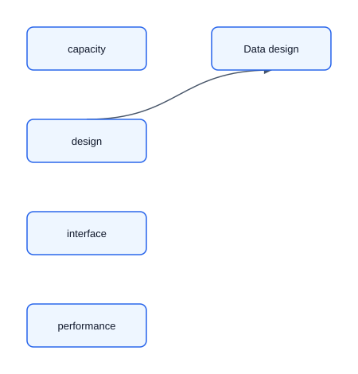

# 01 — Universal Design Framework and Estimation

This chapter adapts the ByteByteGo system design structure for AI systems. The point is to move in a predictable order: clarify, estimate, draw a simple blueprint, define data and interfaces, then discuss scale and failure modes. Resist the urge to start with Kafka, a feature store, fine-tuning, or multi-region deployment unless a requirement pulls you there.

## 1. Requirements clarification

Before drawing, fill in:

```text
User and decision:
Prediction/generation unit:
Input available at that instant:
Output and how it is consumed:
Business goal and cost of harm:
Functional requirements:
Non-functional requirements:
Out of scope:
```

Fraud example: score one card-not-present transaction during authorization; return a risk score and reason codes; policy approves, challenges, or declines; p99 below 100 ms; false declines and fraud loss both matter.

Separate metrics into:

1. **Business:** revenue, loss prevented, time saved, resolution.
2. **Product/online:** CTR, conversion, retention, acceptance, task success.
3. **Model/offline:** PR-AUC, recall@K, NDCG, MAE, groundedness.
4. **System/guardrails:** p99, error rate, cost/request, complaints, safety, fairness.

| Task                | Useful metrics                         | Warning                             |
|---------------------|----------------------------------------|-------------------------------------|
| Rare classification | PR-AUC; recall at fixed precision      | Accuracy is misleading              |
| Ranking             | recall@K, MRR, NDCG                    | Position matters                    |
| Regression          | MAE, RMSE, quantile loss               | Segment the errors                  |
| Forecast            | WAPE/MASE, bias, coverage              | Use rolling backtests               |
| Retrieval           | recall@K, MRR, NDCG                    | Evaluate separately from generation |
| Generation          | task success, groundedness, factuality | Requires a rubric/humans            |

## 2. Capacity estimation

Estimate only what changes the design. State assumptions, round, and preserve units.

```text
average QPS = requests/day ÷ 86,400
peak QPS ≈ average QPS × peak factor
concurrency ≈ QPS × latency_seconds
storage/day = events/day × bytes/event × replication
instances ≈ peak_QPS ÷ throughput_per_instance ÷ target_utilization
```

Example: 100M requests/day is about 1.2k average QPS; at 5x peak, 6k QPS. At 200 ms, peak concurrency is about 1.2k.

For vector systems:

```text
raw vector bytes = count × dimensions × bytes/value
```

For LLM systems:

```text
required token throughput ≈ QPS × (input_tokens + output_tokens)
request cost ≈ input_tokens × input_price + output_tokens × output_price
```

If the estimates are small, say so and keep the architecture simple. If they are large, name the specific pressure: memory, write rate, tail latency, GPU concurrency, data freshness, or regional latency.

## 3. Create high-level design

Start with a box diagram that shows the core data flow. Get interviewer buy-in before deep diving.



A good first-pass AI diagram usually has:

- request path: client → API/orchestrator → data or retrieval → model/rules → policy → response;
- learning path: logs/outcomes → dataset/evaluation → training or prompt/index update → registry/config;
- one explicit fallback or human-review point when harm is material.

Do not add caches, queues, streaming, sharding, active-active regions, feature stores, fine-tuning, or agents in the high-level diagram unless the requirements already force them.

## 4. Data design

ByteByteGo's database-design step maps to AI data design: entities, stores, schemas, labels, features, indexes, and retention.

Define:

- source-of-truth entities and their IDs;
- request, exposure, decision, and outcome events;
- labels, maturity delay, and attribution window;
- features available at prediction time;
- embeddings, chunks, documents, or catalog records when retrieval is involved;
- privacy, retention, deletion, and lineage requirements.

Log exposure before outcome. Without model version, features, prompt/index version, candidates shown, and policy version, later clicks or decisions cannot be attributed.

## 5. Interface design

Specify the contract between components. Keep it small:

```text
Request: entity/user/context, deadline, idempotency key, auth scope
Response: prediction/ranking/answer/action proposal, confidence, reasons/citations, fallback state
Events: exposure, decision, feedback/outcome, model/policy version
Errors: retryable, not retryable, partial result, unavailable
```

For GenAI, tools need typed schemas, timeouts, least privilege, and clear read-vs-write classification. The executor enforces authorization; the prompt is not a security boundary.

## 6. Scalability and performance

Discuss bottlenecks only after the simple design is agreed on. Tie every optimization to a pressure:

- high read QPS → cache, replica, precompute, or approximate retrieval;
- high write/freshness demand → stream or incremental index update;
- large catalog/vector memory → sharding, compression, or tiered retrieval;
- tight p99 latency → parallel calls, smaller model, batching, deadline propagation;
- high LLM cost → routing, shorter context, caching, distillation, or async workflow.

A 200 ms p99 needs an explicit budget, for example: gateway 15, feature fetch 30, retrieval 35, ranker 60, policy 15, network/margin 45 ms.

## 7. Reliability and resiliency

For every dependency define timeout, retryability, idempotency, circuit breaking, fallback, backpressure, isolation, and recovery. Retries use bounded exponential backoff with jitter and only for transient errors.

Common AI fallback ladder:

1. current model or RAG path;
2. previous model or previous index;
3. rules, BM25, popularity, cached result, or smaller model;
4. human review, async completion, or honest unavailability.

Finish the interview by naming bottlenecks, one concrete improvement for the next scale tier, and how you would monitor, canary, and roll back the system.
