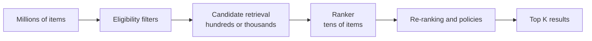

# 02 — ML Foundations for System Design

## Problem formulation

Define unit, target/label and horizon, features available before the decision, output, and the product policy. Example: “For each active account on Monday, predict cancellation in the next 30 days using data through Sunday; contact the top 2%.” This demands temporal cutoffs and precision/value in the top 2%, not global accuracy.

## Labels and leakage

A good label is observable, timely, stable, and aligned. Watch for delayed labels, censoring, poor proxies, selection bias, and feedback loops. Leakage includes future information, variables that encode the outcome, transformations fit on all data, repeated entities across splits, and features that cannot be computed online.

For every feature ask: “What was its effective timestamp, and was it accessible exactly when the decision occurred?”

## Splits

- Random only for truly IID data.
- Temporal for future production behavior.
- Group/entity split to isolate users, patients, documents, or authors.
- Geographic/domain split to test new markets or clients.
- Stable shadow holdout to detect overfitting to repeatedly used benchmarks.

Keep the final test sealed; iterate on train/validation.

## Baselines and model selection

Try: constant/rule → business heuristic/popularity/BM25 → linear or trees → specialized architecture → ensemble/large model only if net value improves.

```text
production utility = quality value − inference cost − operational cost − risk cost
```

For imbalance, prefer PR curves, class weights/focal loss, hard-negative mining, and policy-aware thresholds. Sampling can distort probabilities; recalibrate on representative data.

## Calibration and abstention

A calibrated 0.8 score should be correct about 80% of the time in that band. Use reliability plots, Brier score/ECE, and a separate calibration set. Uncertainty can route to human review, request more information, invoke a larger model, or abstain. Selective prediction exposes coverage-versus-risk explicitly.

## Retrieval and ranking



Candidate sources include popularity, co-visitation, collaborative filtering, two-tower embeddings, content, lexical search, and exploration. Merge, deduplicate, and retain source scores as ranking features.

ANN trades recall for latency/memory. HNSW typically gives excellent latency/recall with high RAM; IVF/PQ compresses better but requires tuning probes and quantization. Measure ANN recall@K against exact search on a sample.

Ranking may be pointwise, pairwise, or listwise. Re-ranking handles diversity, freshness, novelty, inventory, fairness, and policy. Clicks are biased by position and the old policy; log impressions, use controlled exploration, propensity methods, or interleaving. “Not shown” is not a negative label.

### Exploration and bandits

Offline metrics cannot answer “what would users do with something we never showed them.” Exploration is the online complement:

- **ε-greedy:** mostly act greedily, sometimes explore randomly; simple but explores blindly.
- **UCB:** explore actions with the widest uncertainty around their estimated reward; balances mean and variance.
- **Thompson sampling:** sample from the posterior over each action's reward and pick the best sample; efficient and handles cold start naturally.
- **Contextual bandits:** choose actions using features/context, learning which action works for which situation; the bridge toward personalization.
- **Interleaving:** serve a blend of two rankers and attribute to which one generated a clicked item; a fast paired comparison.

Position the exploration budget separately from exploitation so a naive cold-start or freshness policy cannot dominate the feed, and always log the propensity of every shown item so learned policies stay unbiased.

## Post-training and alignment

Base language models predict tokens; making them follow instructions and resist misuse is a separate, data-driven step.

- **Supervised fine-tuning (SFT):** train on demonstrations of desired behavior. Cheap and effective for format/tone, but does not by itself teach calibrated preference or safety reasoning.
- **RLHF:** learn a reward model from human preference pairs, then optimize the policy (often PPO) against it with a KL penalty toward a reference model to limit drift.
- **DPO (direct preference optimization):** optimize preference pairs directly without a separate reward model or online rollout; simpler and often competitive.
- **RLAIF:** use an AI judge to generate preference labels, scaling data but inheriting the judge's biases.

Treat the reward as a proxy: **reward hacking** is when the policy exploits the reward model rather than improving true behavior (verbosity, sycophancy, gaming). Mitigate with KL control, diverse preference data, an evaluation set the reward model never trained on, and human spot-checks. Alignment is evaluated like any other model change — via regression suites, red-teaming, and segment-level metrics — not by the training loss of the reward model.

## Vision and multimodal

Choose classification vs. detection vs. segmentation/OCR, device/edge/cloud placement, frame sampling/tiling, and exact preprocessing parity. Measure by device, lighting, region, and subgroup. Use a cheap gate before heavy video inference; quantize/distill for edge; route uncertainty to review.

## Forecasting

Define horizon, cadence, granularity, and business loss. Use rolling backtests and seasonal-naive baseline. Account for seasonality, promotions, holidays, cold start, hierarchy reconciliation, asymmetric cost, and prediction-interval coverage.

## Learning and causal evaluation

Retrain periodically, incrementally, online, or through active learning depending on label rate and drift. Faster is not always safer: it can learn noise, attacks, or policy feedback. Keep champion/challenger and gates.

Offline improvement is not causal product impact. A/B test with stable randomization, primary metric, guardrails, sufficient duration/power, sample-ratio checks, and segment analysis. If randomization is impossible, mention switchback, geo experiments, diff-in-diff, or propensity methods and their stronger assumptions.
