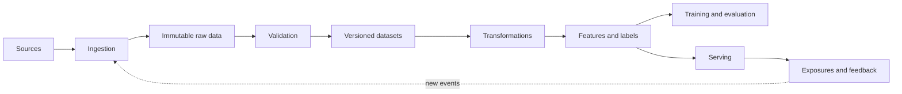

# 03 — Data, Features, Training, and Experimentation

## Data lifecycle

Trace every prediction to model/code, data/features, timestamp/entity, policy, experiment, and observed outcome. Redact or hash sensitive input; logs need purpose and retention.

## Ingestion and quality

Store event time, ingestion time, schema version, source, and event ID. Validate schema, keys/uniqueness, volume/freshness, null/range/distribution, business invariants, and label coverage/delay. Separate hard blockers from warnings. Each alert needs a baseline, severity, owner, runbook, and action.

Schema additions may be compatible; removals, renames, and semantic changes are breaking. Version contracts and use dual read/write during migrations.

Late/out-of-order data requires event-time semantics, watermarks, correction windows, event IDs, and idempotent upserts or atomic partition replacement. “Exactly once” is usually an end effect built from replayable logs, checkpoints, dedupe, idempotency, and transactions.

## Features and point-in-time correctness

Features may be static, window aggregates, sequences, user-item crosses, embeddings, or real-time context. A training row cut off at `t` may only use values effective at or before `t`.

Prevent training-serving skew through shared definitions, compute-once/materialize-twice, the same transformation library, stream snapshots, and automatic offline-vs-online vector comparisons.

A feature store is justified when teams reuse features, need millisecond serving, historical point-in-time joins, and governance. It adds ownership, TTLs, backfills, consistency, and infrastructure; it is not mandatory for a first batch model.

## Labels and human feedback

Define source of truth, attribution window, label maturity delay, unobserved cases, and how the current policy changes what gets observed. Log impression ID, candidates, positions, scores, model version, and experiment before collecting clicks/conversions.

Human labeling needs written guidelines, boundary examples, multiple annotators/adjudication, agreement checks, gold tasks, risk-prioritized queues, privacy controls, and active learning that does not contaminate evaluation.

## Training pipeline

```mermaid
flowchart LR
    snapshot[Validated snapshot] --> extraction[Point-in-time extraction]
    extraction --> split[Split and preprocess]
    split --> train[Train and tune]
    train --> evaluation[Global and segment evaluation]
    evaluation --> safety[Robustness and safety checks]
    safety --> artifact[Artifact and model card]
    artifact --> registry[Registry candidate]
    registry --> rollout[Shadow and canary rollout]
```

Version code, config, dataset manifest, schema, feature/label definitions, seeds, environment/image, hyperparameters, metrics, and artifacts. Jobs should be idempotent, resumable from checkpoints, observable, and parameterized for backfills.

Tune only after fixing data and baseline. Use random/Bayesian/early-stopping search with a budget; never tune on test. Error analysis usually produces more value than blind hyperparameter search.

## Fine-tuning and parameter-efficient fine-tuning (PEFT)

Full fine-tuning updates every weight, which can be expensive and risks catastrophic forgetting of the base model's abilities. PEFT updates a small subset of parameters while the base stays frozen:

- **LoRA** learns low-rank update matrices per target layer, storing only the small deltas; memory and storage are far lower and adapters are cheap to swap.
- **QLoRA** quantizes the frozen base weights while training LoRA adapters, enabling larger models on less hardware.
- **Prompt tuning / soft prompts** learn continuous prefix vectors rather than discrete text (different from prompt engineering).

Choose fine-tuning when behavior/style/task is stable and cannot be met reliably or economically in-context. Do not use it for frequently changing facts, per-document access control, citations, or easy deletion—RAG is the better knowledge path. Adapters are still model artifacts: they need the same versioning, evaluation, serving, safety, and rollback controls as any other deployment, and a base-model change invalidates prior adapter assumptions.

## Promotion gates and deployment

A candidate must beat the champion by a practical margin, avoid regressions in critical segments, meet latency/memory/cost targets, pass schema/privacy/robustness checks, have provenance and rollback, and include documentation.

- **Shadow:** duplicate inputs without decisions; validates latency/differences, not causal impact.
- **Canary:** small real-traffic exposure; limits blast radius.
- **A/B:** measures causal product effects.
- **Blue/green:** full parallel stacks and fast switching.
- **Champion/challenger:** candidate compared with production model.

Use sticky randomization and exclude bots/test traffic.

## Backfills, retraining, deletion

Backfill bounded partitions with controlled concurrency, write a new version, validate/reconcile a sample, and switch an alias atomically. Do not overload downstream systems or overwrite current online features accidentally.

Retraining triggers can be time, enough new mature labels, confirmed performance drift, product/schema change, or incident. Drift alone is not proof that retraining helps.

Privacy deletion spans raw data, features, indices, caches, replicas, and backups—and sometimes models. Maintain lineage and choose re-training or unlearning proportional to risk.
