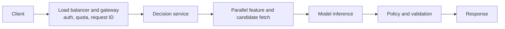

# 04 — Serving, Scalability, and Reliability

## Serving patterns

- **Batch:** cheapest and easiest for periodic scores/precomputed recommendations; less fresh.
- **Online synchronous:** contextual and interactive; requires strict deadlines and fallbacks.
- **Streaming:** continuously updates state/scores; requires ordering, watermarks, replay, and backpressure.
- **Nearline/hybrid:** precompute candidates or embeddings, then rank online; common in search/recommendation.

Propagate deadline and trace ID. Move telemetry and nonessential writes off the critical path.

## Latency and throughput

Optimize in this order: profile queues/work; remove calls/serialization; parallelize independent I/O; cache safely; reduce inputs/model; dynamic batching; quantization/distillation/compilation; faster hardware.

Batching raises GPU throughput but adds wait latency. Use a small time window and maximum batch; separate length/priority queues to prevent head-of-line blocking. Caches may store public responses, features, embeddings, semantic matches, or LLM prefixes/KV state. Define key, TTL, invalidation, tenant isolation, and sensitive-data policy.

Size from peak QPS and measured production-like throughput at 50–70% target utilization. Scale signals may be queue age, concurrency, tokens/s, GPU memory, and p99—not average CPU. Keep warm minimum capacity when loading weights is slow.

## Overload and data distribution

Apply per-tenant quotas, fair scheduling, bounded queues, 429/retry-after, load shedding, and degraded model/context/output. Prioritize interactive traffic over batch.

Shard by a key that spreads load and preserves access (hash user/item/tenant). Plan for hot shards, rebalancing, and cross-shard work. Replicas increase read capacity and availability; decide staleness tolerance. Validate artifact checksums and warm models before readiness.

## SLOs and resilience

Examples: 99.9% semantically successful requests over 28 days; p95 <150 ms and p99 <400 ms; 99% of features fresher than five minutes. HTTP 200 with invalid output is not semantic success.

Use per-hop timeouts below the remaining deadline, bounded exponential-backoff retries with jitter, retry budgets, circuit breakers, and bulkheads. Retry mutating operations only with idempotency keys.

Example recommendation fallback ladder:

1. current personalized ranker;
2. previous model;
3. precomputed recommendations;
4. segment popularity;
5. global/editorial popularity.

Monitor fallback rate because it can hide an outage.

## Multi-region and consistency

Use multi-region only for SLO, residence, or global latency. Active-active improves RTO but complicates consistency and experiments. State RPO/RTO and test failover.

A deployment must bind model to feature schema, preprocessing, and policy versions. Load and warm a new artifact, health-check it, then atomically change routing. Log exact version per response. Keep rollback compatible with feature versions.

## API contract and production checklist

Version schemas; validate size/type; support request IDs, deadlines, typed retryable errors, cancellation, pagination/streaming, and redacted logs. Use idempotency keys for effects.

Before launch: realistic load test, dependency fault injection, canary, rollback/kill switch, dashboards by version/region/tenant/segment, runbooks/on-call ownership, restore/failover test, capacity/cost limits, and event-day capacity review.
