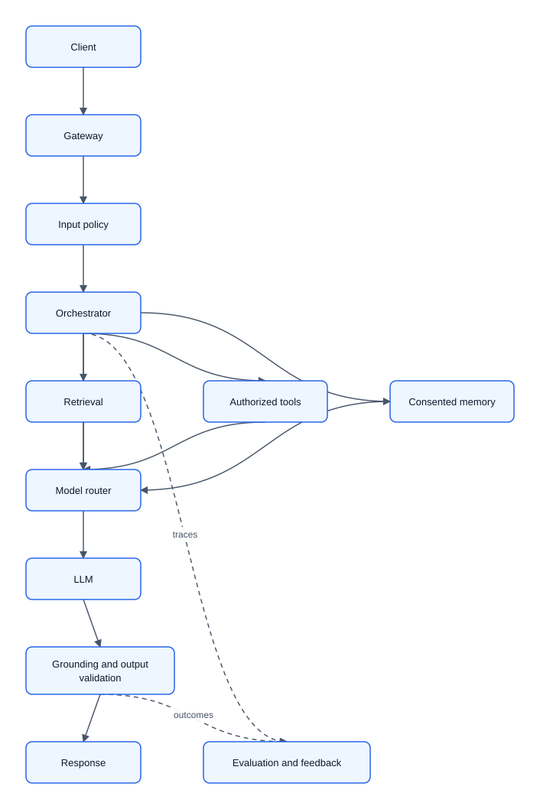
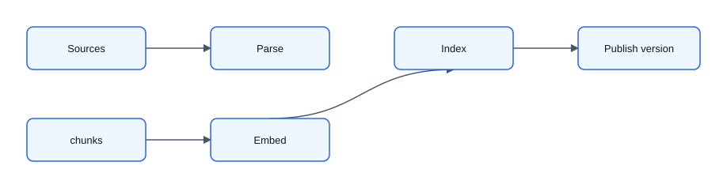
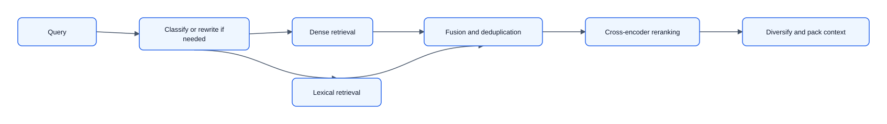
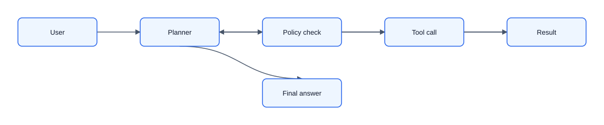

# 05 — LLMs, RAG, and Generative Systems

## Choose the right pattern

| Need                           | Start with                          |
|--------------------------------|-------------------------------------|
| Changing/private knowledge     | RAG                                 |
| Stable style/behavior          | Prompting, then fine-tuning         |
| Narrow high-volume task        | Small/distilled model or classifier |
| Authoritative calculation/data | Tool/API, not model memory          |
| Known sequence of actions      | Explicit workflow                   |
| Variable planning/tool choice  | Bounded agent                       |
| Deterministic correctness      | Rules/parser/program                |

Hybrid systems are usually strongest: models handle ambiguity; deterministic software handles authorization, validation, calculation, and effects.

## Reference architecture



A model router may use risk, language, complexity, latency, context length, and budget. Start with one route; add cascades only when measured value justifies them.

## RAG ingestion



Preserve headings, tables, pages, dates, links, and OCR confidence. Chunk on semantic boundaries. Small chunks improve precision but lose context; large chunks add noise/tokens. Overlap improves continuity but duplicates storage/results. Evaluate multiple sizes; parent-child retrieval can find a small chunk and return its larger section.

Metadata should include source/document ID, tenant, owner, effective date, language, type, version, location, and ACL. Enforce authorization before or during retrieval—never retrieve forbidden content and ask the prompt to hide it.

Use document ID + content hash + version for incremental updates. Tombstone deleted versions, rebuild/version indices, switch aliases atomically, and propagate deletion to lexical/vector stores, caches, and replicas. Monitor indexing lag.

## Retrieval and context

- Lexical/BM25 wins on exact names, IDs, and rare terms.
- Dense retrieval handles semantics and paraphrases.
- Hybrid retrieval plus rank fusion often improves coverage.
- Metadata filters enforce tenant, ACL, date, language, and product scope.



Rewriting may alter intent, so retain the original and evaluate. A reranker adds quality over top 20–100 candidates at extra latency. Measure each stage independently.

Do not fill the context window blindly. Deduplicate, select evidence, preserve source attribution, and reserve tokens for instructions and output. Long context does not remove the need for retrieval; it raises cost/latency and can bury relevant evidence.

## Grounded generation and RAG evaluation

Separate system instructions, untrusted context, user query, output schema, abstention policy, and citation format. Validate that cited chunks actually support each material claim. If evidence is insufficient, ask a clarifying question or abstain.

Evaluation dataset: real, difficult, no-answer, multilingual, permission-sensitive, ambiguous, and adversarial queries. Label relevant sources and expected answer/rubric.

- Retrieval: recall@K, MRR/NDCG, coverage, ACL violations (must be zero), latency.
- Generation: correctness, groundedness, completeness, citation precision, abstention, safety, cost.
- End-to-end: resolution/task success, time saved, escalation, satisfaction, severe-error rate.

Classify failures as retrieval miss, context selection, reasoning, tool, policy, or presentation. LLM-as-judge can scale evaluation, but calibrate it against humans, use a rubric, blind model identity/order, and never make it the sole safety authority.

## Prompting, fine-tuning, and serving

Progression: clear prompt/examples → structured output/tool calling → retrieval → fine-tuning for repeated behavior/style → distillation/self-hosting if scale, control, or privacy warrants it. Fine-tuning is not a database for daily-changing facts.

Serving metrics include time to first token, inter-token latency, total latency, input/output tokens, queue time, batch size, KV-cache utilization/hits, finish reason, retry rate, and cost. Streaming improves perceived latency, not total work. Continuous batching and grouping by length improve utilization. Quantization/speculative decoding need quality validation.

Budget system prompt, history, retrieval, tools, and output separately. Summarize or trim by relevance. Apply daily/tenant quotas and anomaly alerts.

## LLM serving internals

Reasoning about attention and memory is what separates an LLM capacity plan from guesswork.

### Attention and the KV cache

Each attention layer computes queries, keys, and values from the hidden state. During generation the model caches the keys and values of every processed token so the next token does not recompute the entire prefix. The cache size per token:

```text
KV bytes/token = 2 × n_layers × n_kv_heads × head_dim × bytes_per_value
```

- **MHA** (multi-head attention): one K/V head per query head; high capacity, largest cache.
- **MQA** (multi-query attention): a single shared K/V head; smallest cache but can reduce quality.
- **GQA** (grouped-query attention): several query heads share one K/V head; the common middle ground, trading some quality for a much smaller cache.

For a 7B fp16 model with 32 layers and 32 K/V heads of 128 dims, the cache is roughly `2 × 32 × 32 × 128 × 2 ≈ 0.5 MB` per token. A single 4k-token request then needs about 2 GB of KV memory; a few dozen concurrent long-context requests can exhaust a GPU faster than the weights do. The weights of that same 7B fp16 model are about 14 GB.

### Prefill vs. decode

- **Prefill** processes all input tokens in parallel, is compute-bound, and dominates time-to-first-token for long prompts.
- **Decode** produces one token at a time, is memory-bandwidth-bound on autoregressive generation, and dominates total tokens.

This distinction drives batching: prefill benefits from large batches of parallel compute, while decode throughput is limited by how fast weights and KV-cache can be read from memory. Capacity plans therefore benchmark prefill and decode separately, and `tokens/s` alone hides the difference.

### Serving techniques

- **Continuous batching** admits and completes requests in a rolling batch instead of waiting for a full static batch, improving utilization without blocking streaming.
- **Flash attention** reduces the memory and I/O of attention by tiling and recomputing rather than materializing the full attention matrix, enabling longer contexts at the same memory.
- **Paged attention** (vLLM-style) allocates the KV cache in fixed pages rather than a contiguous slab, reducing fragmentation and letting more concurrent sequences share a GPU.
- **Prefix/prompt caching** reuses the KV cache of a shared prefix (system prompt, few-shot examples) across requests, saving prefill compute for common boilerplate.
- **Speculative decoding** drafts several tokens with a cheap model, then verifies them in parallel with the large model; accepted drafts speed up decode at the same output distribution, but it only helps when the draft and target agree often.
- **Quantization** shrinks weights and activations to int8/int4, reducing memory and raising effective batch, with a possible quality and hardware-dependent trade-off.

The interview argument is: given concurrency, mean/max context length, and the KV-cache formula, choose the memory per replica; given prefill/decode benchmarks, choose replicas and batching; then validate any quality-affecting optimization (quantization, speculative decoding) on the eval set before rollout.

## Tools and agents

Every tool needs an unambiguous purpose, typed schema, structured output, least privilege, timeout, safe retry/idempotency, read-vs-write classification, audit log, and compensation where possible. The executor—not the prompt—must enforce authorization.



Add loop detection, cancellation, checkpoints, and partial results. High-impact actions follow preview → explicit human confirmation → idempotent execution.

## Memory

Separate conversation context, summaries, episodic memories, structured user preferences, and retrieved knowledge. Memory should be consented, visible/editable, TTL-bound, and tenant-isolated. Do not store sensitive inferences as facts. Memory retrieval itself needs relevance and authorization.

## Threats and degradation

Treat retrieved documents, web pages, emails, and tool outputs as untrusted data. Separate data from instructions, allowlist tools/arguments, keep secrets out of context, sandbox code, validate outputs, restrict egress, require confirmations, and continuously red-team injection/exfiltration.

Other threats: jailbreaks, tenant leakage, data poisoning, model extraction, denial of wallet, PII in logs, unsafe SQL/HTML/shell output, and confident hallucination.

Fallbacks: lexical retrieval if vector search fails; smaller model or async if capacity is saturated; no-action answer if a tool fails; review queue for parser/OCR failure; abstain when evidence is inadequate. Honest uncertainty is a system feature.
