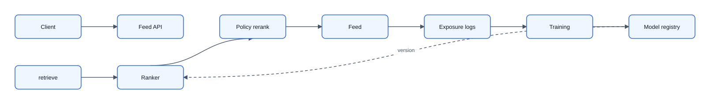
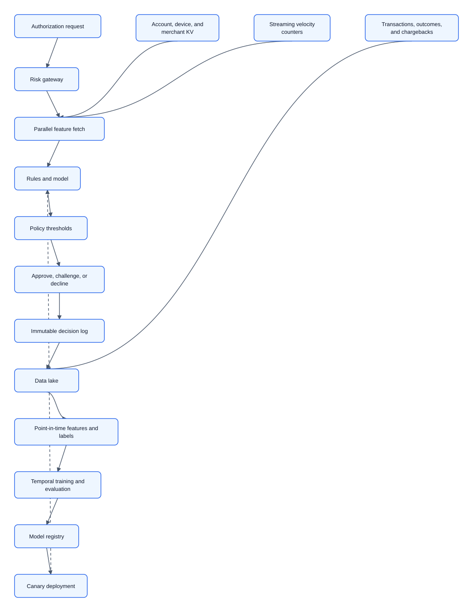
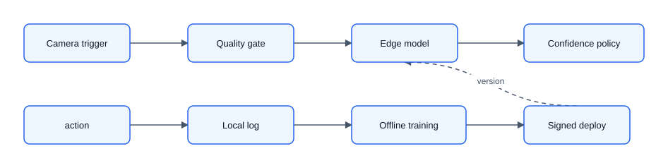
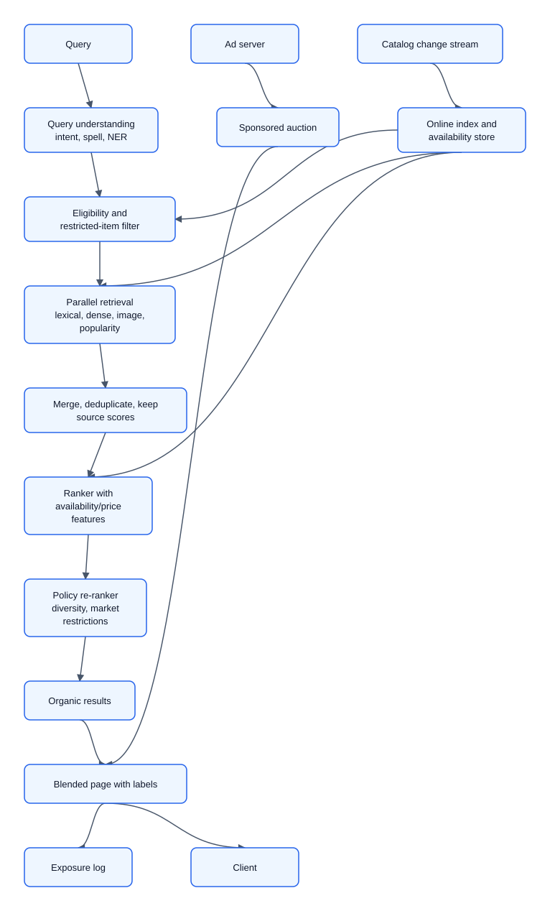
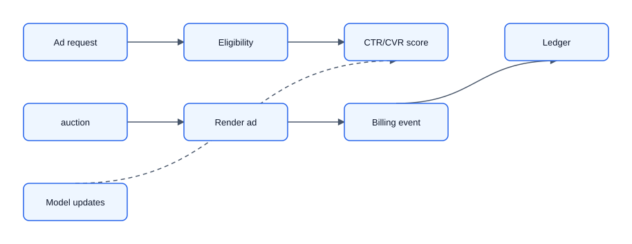
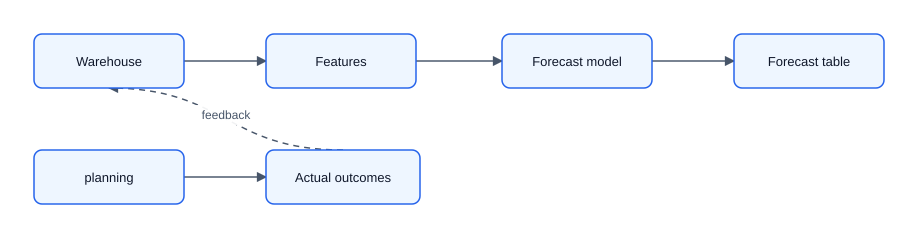

# 08 — Solved Classical ML Cases

These model answers intentionally follow the same ByteByteGo-style sequence. Each starts simple, earns buy-in with a high-level diagram, and adds only the details needed by the stated requirements.

## Case 1: Design a personalized video recommendation feed

### 1. Requirements clarification

Assume a home feed for 50M daily users and 10M eligible videos. A request returns 20 ranked items. Optimize satisfied watch time and retention, not raw clicks. Guardrails include harmful-content exposure, creator concentration, empty-feed rate, p99 latency, and complaints.

Out of scope for V1: ad ranking, video transcoding, graph-based creator analysis, and real-time sequence modeling.

### 2. Capacity estimation

At 10 feed requests/user/day, traffic is 500M requests/day, about 5.8k average QPS and 30k peak QPS at 5x. A 200 ms p99 target implies roughly 6k concurrent in-flight requests. Ten million 256-dimensional fp16 item embeddings are about 5 GB raw before ANN/index overhead.

### 3. Create high-level design

The first-pass design is a two-stage recommender: retrieve a few hundred candidates cheaply, rank them with a stronger model, apply policy rules, and log exposures before outcomes.

### 4. Data design

Core records are users, videos, creator metadata, impressions, interactions, hides/reports, and model decisions. Labels combine completed watch, positive feedback, and negative feedback over fixed horizons. Use temporal splits and point-in-time features; an item the user never saw is not automatically a negative label.

### 5. Interface design

`GET /feed?user_id=&request_id=` returns ranked video IDs, reasons/debug metadata for internal logs, and the model/policy version. Exposure events include request ID, candidates shown, positions, candidate source, scores, and experiment.

### 6. Scalability and performance

Run candidate sources in parallel with deadlines. Start with offline item embeddings plus recent user history, follows, trending, and a small exploration pool. Add sharding, streaming features, or a heavier reranker only if candidate coverage, freshness, or latency measurements force it.

### 7. Reliability and resiliency

Fallback ladder: current ranker → previous model → precomputed personalized feed → segment popularity → global/editorial popularity. Monitor p99 latency, empty-feed rate, source coverage, feature freshness, fallback rate, harmful-content exposure, and quality by new-user/region/device.

## Case 2: Design real-time payment fraud detection

### 1. Requirements clarification

Score card-not-present transactions during authorization. Return a risk score and reason codes; a policy service approves, challenges, or declines. Peak is 20k TPS, p99 model-system budget is 80 ms, and availability target is 99.99%. False declines hurt legitimate customers; false negatives lose money.

Out of scope for V1: graph neural networks, real-time model retraining, and fully automated policy tuning.

### 2. Capacity estimation

20k TPS means the online path must stay small and predictable. At 80 ms, peak concurrency is about 1.6k requests. Decision logs are modest per event, but retention and audit requirements matter because chargeback labels can arrive weeks later.

### 3. Create high-level design

The ML service scores risk; the payment authorization service owns the final money-moving decision.

### 4. Data design

Use transaction, account, device, merchant, authentication, velocity, and chargeback records. Historical joins must be point-in-time correct. Labels include confirmed fraud and mature legitimate transactions; manual-review outcomes are biased by the old policy.

### 5. Interface design

`POST /risk-score` accepts transaction context, account/device IDs, deadline, and idempotency key. It returns calibrated risk, reason codes, model version, feature freshness, and fallback state. Decision events are immutable and include policy version.

### 6. Scalability and performance

Keep the online model simple: rules plus a calibrated tree model is a strong baseline. Precompute slow features, store online velocity counters with TTLs, and enforce strict per-hop deadlines. Consider graph features later only if replay evaluation shows incremental value within latency.

### 7. Reliability and resiliency

Fallback ladder: current model → previous model → signed static rules and cached risk tiers → conservative challenge/review for risky cohorts. Use circuit breakers, no uncontrolled retries, artifact signing, feature freshness alerts, cohort drift monitoring, and canary rollout.

## Case 3: Design visual defect detection for a factory line

### 1. Requirements clarification

Inspect each manufactured part from one or more cameras and accept, divert, or send it to review. The line cannot depend on wide-area network access. Maximum decision time is 120 ms. Missing a safety-critical defect is worse than a false reject.

Out of scope for V1: cloud-only inference, automated line shutdown decisions, and custom hardware design.

### 2. Capacity estimation

Estimate parts per second per line, images per part, image size, and edge device throughput. If one line produces 10 parts/second and each part has two images, the edge path handles 20 images/second plus local buffering.

### 3. Create high-level design

The high-level design keeps inference at the edge and sends logs/images upstream asynchronously for training and audit.

### 4. Data design

Store images, camera metadata, part IDs, line/shift/material, model version, decision, operator override, and downstream audit result. Split by time, batch, and line rather than random adjacent frames. Use a quality gate for blur/occlusion before defect classification.

### 5. Interface design

The edge service accepts camera frames and part metadata, then returns `accept`, `divert`, or `review` with confidence, defect type, and model version. Upload events include image URI, decision, override, and retention class.

### 6. Scalability and performance

Benchmark on the exact edge hardware. Start with a compact detector or classifier and only add segmentation if location materially helps review/rework. Quantization and distillation are justified if the model misses the 120 ms budget after profiling.

### 7. Reliability and resiliency

Fallback ladder: current edge model → previous signed model → manual inspection or lane stop for safety-critical failures. Monitor latency, camera focus/brightness, defect rate, operator overrides, model temperature, and audit escapes.

## Case 4: Design product search for a marketplace

### 1. Requirements clarification

Search over 500M active listings for 100M daily users. Queries may be text or image. Results must be relevant, available, policy-compliant, and clearly separate sponsored placements. p99 latency is 250 ms; inventory and price changes should appear within one minute.

Out of scope for V1: voice search, per-seller bidding optimization, and fully custom search infrastructure.

### 2. Capacity estimation

Hundreds of millions of searches/day gives thousands to tens of thousands of peak QPS. A full catalog scan is impossible, so use two-stage retrieval and ranking. A 500M-item embedding index at 256 fp16 dimensions is about 256 GB raw before index overhead and replicas.

### 3. Create high-level design

The first-pass design combines query understanding, hybrid retrieval, ranking, policy reranking, and exposure logging.

### 4. Data design

Core records are listings, sellers, inventory/price, query logs, impressions, clicks, carts, purchases, and policy labels. Index documents include title, attributes, image embeddings, category, market, availability, price, and restricted-item flags.

### 5. Interface design

`GET /search?q=&market=&user_context=` returns organic results and separately labeled sponsored results. Index update events carry listing ID, changed fields, content hash, effective time, and tombstone state.

### 6. Scalability and performance

Start with BM25 plus dense retrieval and a GBDT/neural ranker over a few hundred candidates. Incrementally update availability and price; rebuild larger embedding/index structures asynchronously. Add sharding by market/category when index size or regional latency requires it.

### 7. Reliability and resiliency

Fallback ladder: hybrid retrieval → lexical retrieval → category/popularity fallback → clear no-results state. If availability is stale, prefer hiding uncertain listings over showing delisted items. Monitor zero-result rate, p99, index lag, restricted-item leakage, and relevance by query class.

## Case 5: Design a sponsored ads ranking system

### 1. Requirements clarification

For each feed/search surface, select and rank ads alongside organic content. Advertisers bid; the platform must enforce relevance, budget, pacing, labeling, and billing correctness. Assume p99 150 ms for the ad call.

Out of scope for V1: cross-surface budget optimization, real-time bidding exchange support, and deep reinforcement learning.

### 2. Capacity estimation

At large social scale, ad ranking can reach very high QPS, but each request should score a bounded candidate set. Estimate candidate count, features per ad, model latency, budget-write rate, and accounting event volume.

### 3. Create high-level design

The model predicts CTR/CVR; a separate auction and pacing layer applies bid, budget, reserve price, and relevance constraints.

### 4. Data design

Core records are campaigns, creatives, bids, budgets, targeting rules, impressions, clicks, conversions, and billing ledger entries. Prediction labels are delayed and biased by prior serving policy, so log propensities and positions.

### 5. Interface design

`POST /ad-candidates` accepts surface, slot, user/context features, and deadline. It returns selected ads with auction metadata, price, model version, and billing/event IDs. Billing writes use idempotency keys and event dedupe.

### 6. Scalability and performance

Start with targeting filters, a calibrated CTR model, and deterministic auction logic. Cache campaign eligibility and precompute heavy features. Add more candidate sources, CVR modeling, and pacing sophistication only after the baseline meets correctness and latency.

### 7. Reliability and resiliency

Fallback ladder: current scoring → relevance-only ranking with budget checks → no ad for the slot. Never serve past budget. Reconcile billing against an immutable ledger and alert on over-delivery, dedupe failures, p99, invalid clicks, and calibration drift.

## Case 6: Design a retail demand forecasting system

### 1. Requirements clarification

Forecast per-item demand at store or warehouse level for replenishment and staffing. Weekly cadence is acceptable, but promotions, holidays, and new items matter. The cost of under-forecasting and over-forecasting is asymmetric by category.

Out of scope for V1: real-time price optimization and fully automated purchase-order execution.

### 2. Capacity estimation

Estimate SKU-store pairs, history length, forecast horizon, retraining cadence, and downstream consumers. If 1M SKU-store pairs need 28 daily horizon points, each run produces 28M forecast values plus intervals.

### 3. Create high-level design

This is a batch system first: build features, train or score forecasts, publish a versioned forecast table, and collect actual outcomes.

### 4. Data design

Use sales, inventory, price, promotions, holidays, store attributes, item attributes, and stockout flags. Rolling backtests prevent future leakage. Forecasts should include point estimates, prediction intervals, hierarchy level, model version, and generated timestamp.

### 5. Interface design

Planning systems read `forecast_version`, `sku`, `location`, `date`, `p50`, `p90`, and explanatory drivers. Upstream data contracts include effective dates for promotions and inventory corrections.

### 6. Scalability and performance

Start with seasonal-naive baselines, then add regression/GBDT or time-series models where error reduction justifies complexity. Partition jobs by category or region. Add hierarchy reconciliation only when planners need totals to match across levels.

### 7. Reliability and resiliency

Fallback ladder: current forecast → previous forecast version → seasonal-naive/category baseline. Monitor input freshness, run completion, forecast bias, interval coverage, stockout-aware error, and worst categories. Roll back by switching the forecast version alias.
