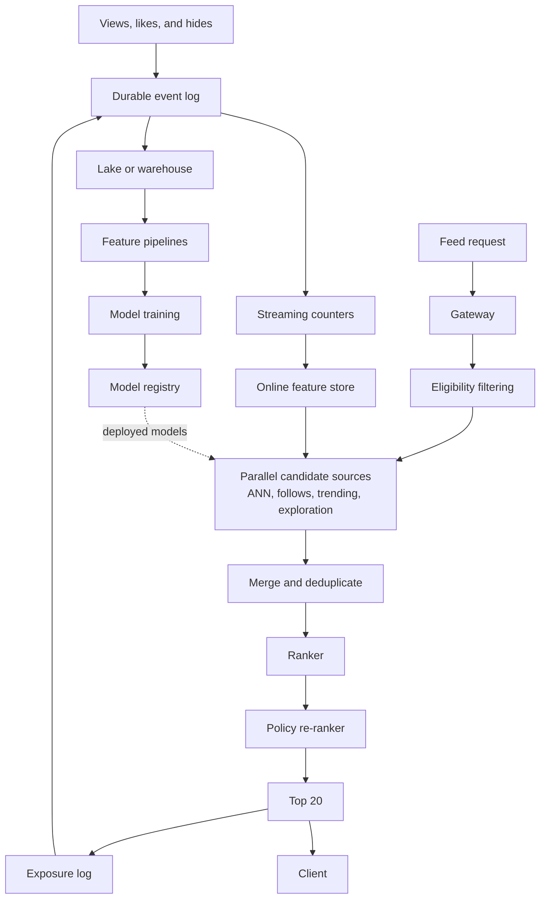
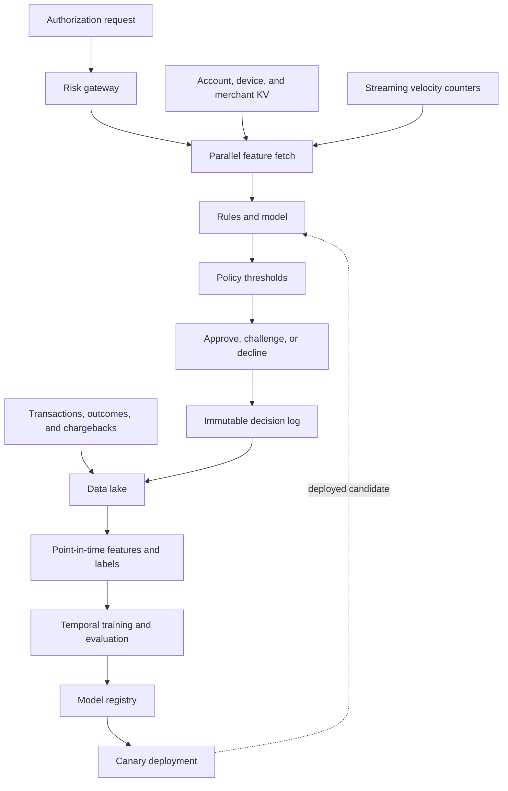
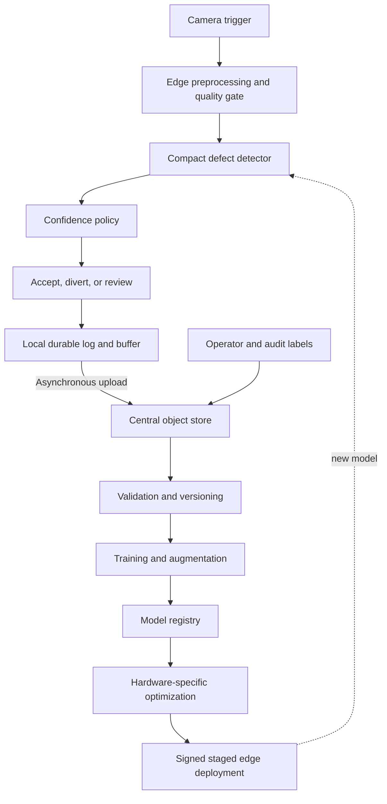
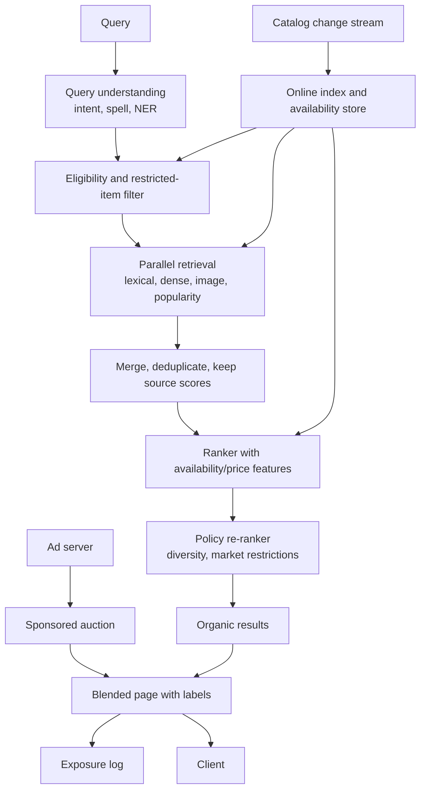
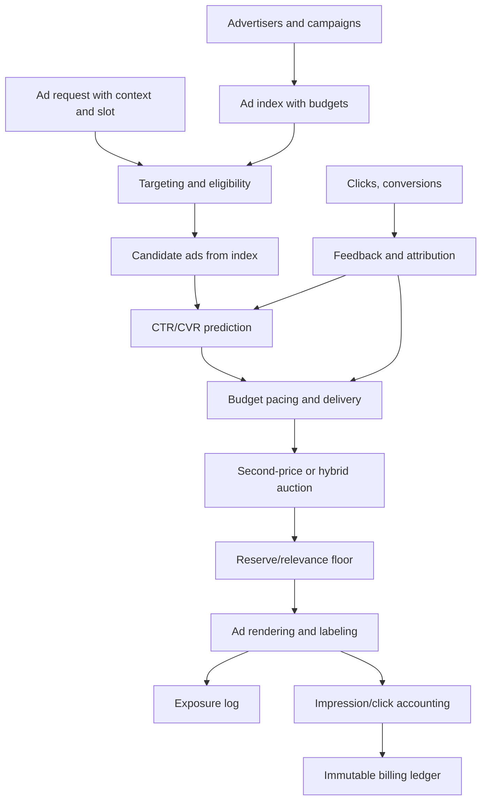
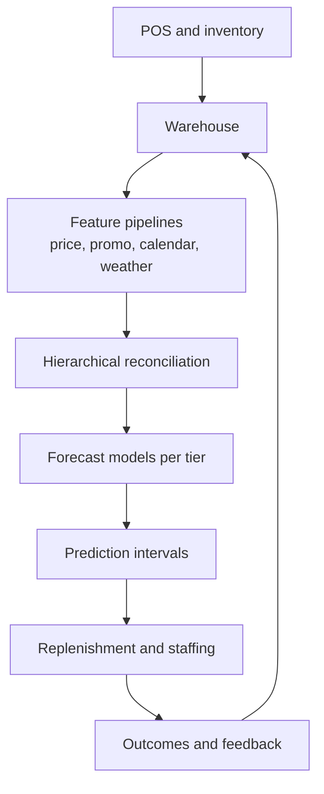

# 08 — Solved Classical ML Cases

These are model answers, not unique correct designs. Practice stating assumptions and letting the interviewer redirect you.

## Case 1: Design a personalized video recommendation feed

### 1. Clarify and scope

Assume a home feed for 50M daily users and 10M eligible videos. A request returns 20 ranked items. Optimize long-term satisfied viewing, not raw clicks. p99 server latency is 200 ms and availability 99.95%. Content policy and creator ecosystem health are hard constraints.

Out of scope for V1: ad ranking and video transcoding.

### 2. Metrics

- Business/product: retained users and satisfied watch time per session.
- Online: completion, like/hide, return rate; guardrails for complaints, harmful-content exposure, diversity, creator concentration, and latency.
- Offline retrieval: recall@500 against future positive interactions.
- Offline ranker: NDCG@20, calibration, and negative-feedback rate by segment.

Why not CTR alone? Clickbait can increase clicks while harming completion and retention.

### 3. Scale

Assume 10 feed requests/user/day: 500M/day ≈ 5.8k average QPS; 5× peak ≈ 30k QPS. At 200 ms, about 6k concurrent requests. Logging 200 candidate/exposure records per request at roughly 100 bytes is 10 TB/day before compression—so logs are partitioned, compressed, and governed.

Ten million 256-dimensional fp16 item embeddings are about 5 GB raw, feasible per large-memory replica; ANN overhead and metadata add more. Replication, not sharding, may initially meet QPS, but regional/tenant/content partitions may later require shards.

### 4. Architecture

### 5. Data and modeling

Log impressions before outcomes: request, user, all shown items/positions, candidate-source scores, model version, and experiment. Labels combine completed view, dwell, like/share, hide/report with carefully chosen horizons. A “not shown” item is not a negative.

Use a temporal split and point-in-time features. Candidate retrieval uses a two-tower model: item embeddings can be computed offline; user embedding uses recent history. Merge with follows, trending, and exploration to cover cold start and long tail.

The ranker uses user, item, cross, sequence, context, and source features. A multitask model predicts completion, positive feedback, and negative feedback; a configurable policy combines calibrated outputs. Re-rank for eligibility, freshness, diversity, creator caps, and safety.

Why two stages? Scoring 10M items with a rich model cannot meet 200 ms. A cheap retrieval stage reduces the set to about 500, and a richer ranker improves ordering.

### 6. Cold start and bias

- New user: onboarding interests, locale/context, and diversified regional popularity; explore quickly.
- New video: content embedding, creator prior, and bounded exploration.
- Position bias: small randomized buckets/interleaving and propensity-aware learning.
- Feedback loop: exploration budget, diversity constraints, and shadow evaluation of new candidate sources.

### 7. Reliability

Budget: gateway 15 ms, online features 30, candidate generation 45, ranking 60, policy 15, margin 35. Candidate sources run in parallel with deadlines. If ANN fails, use follows/trending; if online features are stale, use cached user vector; if ranker fails, use source scores or precomputed feed.

Use per-user/tenant limits, bounded queues, canary deployment, model/feature schema binding, and exposure-log durability. Monitor source coverage, empty-feed rate, feature freshness, p99, fallback rate, score drift, safety rate, and metrics by new-user/region/device.

### 8. Launch and evolution

V0: popularity/follows with telemetry. V1: two-tower + tree/small neural ranker. Shadow for latency and candidate overlap; canary for safety; sticky A/B for retention and guardrails. Add streaming sequence features only if fresher behavior produces measurable lift. Add heavier reranker only if benefit exceeds latency/cost.

### 9. Likely follow-ups

- **100× catalog:** shard/quantize index, route queries, tier old content, approximate retrieval.
- **Global launch:** regional indices/serving, residence controls, local trends and policy.
- **Filter bubbles:** user controls, exploration, topic/creator diversity, long-term metrics.
- **Deleted content:** eligibility store checked in critical path plus rapid index tombstones.

---

## Case 2: Design real-time payment fraud detection

### 1. Clarify and scope

Score card-not-present transactions during authorization. Output risk score and reason codes; policy approves, challenges, or declines. Peak 20k TPS, p99 model-system budget 80 ms, 99.99% availability. False declines damage customers; false negatives lose money. Labels mature after chargebacks, often weeks later.

### 2. Metrics

- Business: fraud dollars prevented minus false-decline loss and review/challenge cost.
- Offline: recall at fixed false-positive or approval rate, PR-AUC, expected dollar cost, calibration.
- Online: fraud basis points with delayed labels, approval conversion, challenge rate, manual review rate.
- Guardrails: p99/availability, disparities by legitimate segment, complaints, fallback rate.

Accuracy is unusable because fraud is rare. Dollar-weighted loss complements transaction-level recall.

### 3. Architecture

The final authorization service owns the decision. The ML service returns score/reasons and cannot directly move money.

### 4. Features and labels

Features: amount/currency, merchant risk, device/IP consistency, account age, prior behavior, velocity over 1m/1h/1d, graph relationships, and authentication outcome. Compute historical joins as of authorization time. Online aggregates use event time, dedupe IDs, TTL, and stream checkpoints.

Chargeback labels are delayed and incomplete; include confirmed fraud and mature legitimate transactions only. Use a gap between train and validation to let labels mature. Manual-review outcomes are selection-biased because the old policy chose what to review. Maintain small exploration/review samples where legally and ethically acceptable.

Start with interpretable rules plus gradient-boosted trees; graph or sequence models are justified later if incremental value clears latency and operational cost. Calibrate the score. Use two thresholds: low risk approve, medium challenge/review, high decline. Thresholds vary only under governed policy, not arbitrary model code.

### 5. Reliability and adversaries

Strict timeouts and no uncontrolled retries. If streaming counters fail, use last good aggregates and raise risk-policy safeguards; if model service fails, use signed static rules and cached risk tiers. Circuit-break dependencies, isolate merchants/regions, and use active-active serving if the SLO requires it.

Attackers adapt. Monitor feature/score drift, velocity anomalies, approval/fraud by cohort, model extraction patterns, and coordinated probes. Do not expose detailed reason codes externally. Protect feature pipelines from event poisoning and sign/version artifacts.

### 6. Evaluation and rollout

Replay historical data with exact point-in-time reconstruction; evaluate by amount, country, merchant, account age, and attack type. Shadow to validate feature parity and latency. Canary cautiously because decisions cause harm. Use rollback/kill switch and manual review for uncertain high-value cases. Online evaluation needs label-delay dashboards and early proxies, but promotion cannot rely only on proxies.

### 7. Why this answer is strong

It separates probabilistic score from governed policy, handles delayed/biased labels, treats latency and availability as financial requirements, and assumes intelligent adversaries rather than static IID data.

---

## Case 3: Design visual defect detection for a factory line

### 1. Contract

Inspect each manufactured part from multiple cameras. Stop/divert defective units before packaging. The line cannot depend on wide-area network access. Maximum decision time 120 ms; missing a safety-critical defect is much worse than a false reject. Operators can review uncertain cases.

### 2. Metrics

- Business: escaped-defect cost + false-reject/rework cost + downtime.
- Offline: per-defect recall at a fixed false-reject rate; localization IoU/mAP if bounding boxes matter.
- Online: escape rate from downstream audit, review rate, line throughput.
- Guardrails: latency, edge availability, performance by camera/line/material/shift, operator overrides.

### 3. Design

Edge serving removes network dependency and reduces latency/privacy exposure. A central control plane distributes signed artifacts and receives telemetry, but the line continues with the last known-good version.

### 4. Data/model reasoning

Split by production batch/time/line, not random frames, because adjacent images are nearly duplicates. Preserve camera calibration and preprocessing exactly. Include normal variation and rare defects; use targeted collection/active learning, synthetic augmentation only after realism checks, and multiple annotators for ambiguous defects.

A detector or segmentation model is appropriate if location supports operator trust/rework; a classifier is simpler if only accept/reject matters. Quantize or distill against the exact edge hardware. A cheap image-quality model first catches blur/occlusion and requests recapture rather than labeling the part defective.

### 5. Safety and operation

Use confidence bands: accept, uncertain/manual review, reject. For safety-critical classes, bias toward recall and cap the allowed review queue. Monitor camera shift, brightness/focus, input embeddings, defect distribution, latency/temperature, overrides, and eventual audit labels. If camera/model fails, switch to documented manual inspection or stop the affected lane—not silent approval.

Roll out one line/shift at a time; retain champion locally; support atomic rollback. Revalidate after camera, lighting, supplier, or material changes. The important insight is that process drift often matters more than abstract model drift.

---

## Case 4: Design product search for a marketplace

### 1. Clarify and scope

Search over 500M active listings for 100M daily users. Queries may be text, image, or both. Results must be relevant, available, and personalized, with sponsored placements separated from organic ranking. p99 latency is 250 ms and availability 99.95%. Inventory and price changes must appear within one minute. Multi-market launch brings different restricted-item policies.

V1 scopes out voice search and bidding optimization.

### 2. Metrics

- Business: successful purchases per search session and gross merchandise value.
- Online: click-through, add-to-cart, conversion, zero-result rate; guardrails for latency, complaints, and restricted-item exposure.
- Offline retrieval: recall@K against items users eventually purchased or interacted with.
- Offline ranker: NDCG@K, purchase/engagement-weighted; per-query-class and per-market evaluation.
- Search-specific: query abandonment, reformulation rate, and relevance of the top result.

### 3. Scale and freshness

100M users × several searches/day is hundreds of millions of queries/day, roughly thousands to tens of thousands of QPS at peak. A two-stage design keeps the heavy ranker on a few hundred candidates. One-minute inventory freshness rules out nightly batch indexing for the eligibility/freshness signals; use a change stream to update an online index and an availability/price store. The full catalog of 500M embeddings at 256 dims fp16 is about 256 GB raw, so shard by region/category and replicate hot shards.

### 4. Architecture

Sponsored items are clearly labeled and bid through a separate auction; organic relevance does not depend on bid. Query understanding handles typos, intent, and entity extraction before retrieval.

### 5. Data and modeling

- **Query understanding:** normalization, spell correction, intent/entity extraction; low recall here poisons every later stage.
- **Retrieval:** hybrid lexical (BM25) + dense (two-tower or single-vector) + image embedding for image queries; popularity and category as fallback candidates. Fusion combines their scores.
- **Ranking:** features for query-item relevance, price, seller/listing quality, availability, shipping, personalization, and source scores. A GBDT or neural ranker predicts purchase likelihood.
- **Freshness:** item availability and price live in an online store updated from the change stream; the embedding index is refreshed incrementally with content-hash-based upserts and tombstones.
- **Cold start:** new listings use content/attributes and seller prior plus bounded exploration; new users use locale and category popularity.
- **Bias:** log query, shown items/positions, and source scores before outcomes; position bias via small randomization buckets and propensity weighting.

### 6. Reliability and multi-market

Latency budget: parse 20 ms, eligibility 15, retrieval 80 (parallel), rank 90, policy 15, network/margin 30. Retrieval sources run in parallel with deadlines. If dense retrieval fails, fall back to lexical/popularity; if the ranker fails, use fused retrieval scores; if the availability store is stale, fail to the last known-good snapshot rather than showing delisted items.

Restricted-item policy is enforced by market in the eligibility filter, in indexing, and again at serving. Multi-market is sharded with regional indices, local trend/policy, and per-market evaluation, not one global model with an override flag.

### 7. Evolution

V0: BM25 + popularity with telemetry. V1: hybrid retrieval + GBDT ranker. V2: dense multimodal retrieval, personalization, sponsored auction tuning, then per-market models only when segment lift justifies the split.

---

## Case 5: Design a sponsored ads ranking system

### 1. Clarify and scope

For each feed/search surface, select and rank ads alongside organic content. Advertisers bid; the platform controls relevance, budget, and user experience. 1M requests/sec at peak is possible at top social scale; assume a p99 of 150 ms for the ad call. Money is involved, so correctness, accounting, and fraud resistance are hard requirements.

### 2. Metrics

- Business: advertiser value, platform revenue, and long-term user retention.
- Product: ad CTR, conversion, ad fatigue/complaints, and organic-content engagement (ads must not destroy it).
- Offline: predicted CTR/CVR AUC and calibration; auction simulation revenue under pacing constraints.
- Guardrails: latency, budget over-delivery, billing discrepancies, click fraud rate, and relevance.

### 3. Architecture

Keep the auction deterministic and auditable: the model predicts CTR/CVR, and a separate auction service applies bid, relevance floor, and pacing. Predicted probabilities feed expected-value bidding rather than raw scores.

### 4. Modeling and money

- **CTR/CVR prediction:** sparse features (ad, user, context, cross), calibrated outputs because bids multiply them. Segment calibration matters more than global AUC.
- **Budget pacing:** deliver budget smoothly over the campaign using pacing multipliers so high-value ads do not blow their budget at midnight. Pacing is stateful and must be correct across retries.
- **Attribution:** conversion attribution windows and last-click vs. data-driven attribution; delayed conversions require patience before labeling.
- **Click fraud:** detect bots/invalid clicks with rules and models, and do not bill or optimize on flagged traffic. Deduplicate impression/click events via IDs.
- **Exploration:** new ads and new audiences need bounded exploration with logged propensities so early CTR estimates are not systematically biased.

### 5. Reliability

The auction path is on the critical rendering path; use a strict deadline with parallel candidate/scoring calls and a fast default. If scoring is slow or down, fall back to a relevance-only ranking (bid × quality floor) and never serve an ad past its budget. Accounting is idempotent (event ID dedupe) and reconciled against the ledger; over-delivery and billing discrepancies are alarms with owners.

### 6. Evolution

V0: targeting by keywords + CPM with relevance floor. V1: CTR model + pacing. V2: CVR/expected-value bidding, data-driven attribution, fraud model, then multi-objective optimization that guards organic engagement.

---

## Case 6: Design a retail demand forecasting system

### 1. Clarify and scope

Forecast per-item demand at the store/warehouse level for a planning horizon of days to weeks, to drive replenishment and staffing. Weekly cadence is acceptable for decisions, but promotions, holidays, and new items make naive models fail. The cost of under-forecasting (stockout) and over-forecasting (waste/markdown) is asymmetric and per-category.

### 2. Metrics

- Business: stockout rate, waste/markdown, inventory turns, and lost sales.
- Offline: WAPE and MASE against a seasonal-naive baseline; forecast bias; prediction-interval coverage (e.g., 90% intervals contain the truth ~90% of the time).
- Online: actual-vs-forecast error by item tier, category, and horizon.
- Guardrails: freshness of the forecast pipeline, hierarchical consistency, and cold-start coverage.

### 3. Design

Forecast by aggregation level (SKU × store), then reconcile so children sum to parents. Use a strong seasonal-naive baseline before any model; then a mix of time-series (SARIMA/ETS), regression with promo/price/calendar features, and ML (GBDT/quantile regression) depending on data volume. Quantile regression or conformal prediction yields intervals, not just point forecasts.

### 4. Reasoning and edge cases

- **Promotions/holidays:** encode as features with lead/lag effects; evaluate specifically on promo periods.
- **New items:** no history, so use attributes, similar-item history, and category priors; decay priors as sales accumulate.
- **Intermittent demand:** sparse sales need different distributions (e.g., zero-inflated or count models) and per-item uncertainty.
- **Hierarchy:** reconcile top-down/bottom-up or with a constrained estimator so store forecasts sum to regional totals.
- **Rolling backtest:** train on a past window, predict the next, walk forward; never evaluate on shuffled or future-leaking data.
- **Asymmetric cost:** tune toward under- vs. over-forecast per category using the business cost, not symmetric error.

### 5. Operations

Retrain on a schedule with drift alerts; a forecast is stale, not wrong, if inputs lag. Monitor bias by tier, interval coverage, and worst-case categories; tie each alert to a replenishment action. Start with a seasonal-naive baseline and a small number of high-value SKUs, then expand models only where error reduction justifies complexity.
