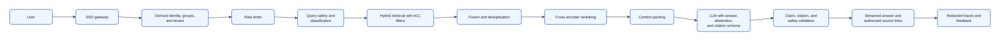
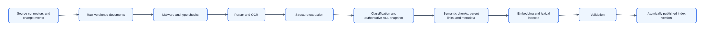
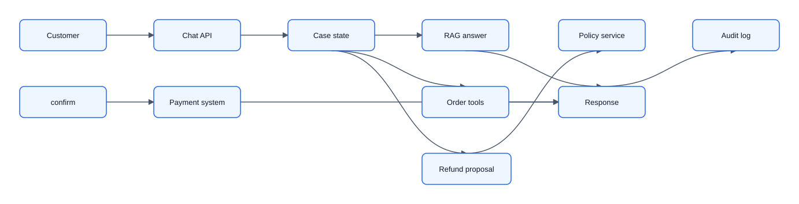
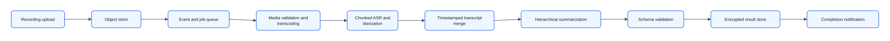

# 09 — Solved Generative AI Cases

These examples use the same ByteByteGo-style sequence as the classical ML cases. Generative systems still need prompt, retrieval, tool, and safety detail, but those details belong in the deep dive after the high-level design is agreed on.

## Case 1: Design a permission-aware enterprise knowledge assistant

### 1. Requirements clarification

Employees ask questions over internal documents. Answers must cite sources, respect permissions, and abstain when evidence is weak. Assume 100k employees, 10 questions/user/day, 5x peak, p95 first token under 2 seconds, and 99.9% availability.

Out of scope for V1: public web search, business-action execution, long-term memory, and fine-tuning on private documents.

### 2. Capacity estimation

One million queries/day is about 12 average QPS and 60 peak QPS. If each query uses 2k input tokens and 400 output tokens, peak work is about 144k tokens/second before retries. Ten million 768-dimensional fp16 chunks are about 15 GB raw vectors before index overhead and replicas.

### 3. Create high-level design

The high-level query path is identity → retrieval with ACL filters → context packing → LLM → validation → answer with authorized source links.

### 4. Data design

Core records are documents, versions, chunks, metadata, ACL snapshots, embeddings, lexical index entries, queries, cited sources, answer traces, and feedback. Use document ID, content hash, tenant, owner, effective time, path, and permission scope. Deletions use tombstones and index versioning.

### 5. Interface design

`POST /ask` accepts user identity from auth middleware, query, conversation ID, deadline, and retrieval budget. It returns answer text, cited source IDs, confidence/abstention state, and trace ID. Source-link resolution performs a fresh permission check.

### 6. Scalability and performance

Start with one model route, hybrid lexical+dense retrieval, and a small rerank/context budget. Add cascades, cache, index partitioning, or async answers only when latency, cost, or tenant size requires them. Cache keys must include tenant and permission scope.

### 7. Reliability and resiliency

Fallback ladder: full RAG → lexical retrieval → answer unavailable with relevant source links → human/helpdesk path. Fail closed on stale ACLs. Monitor retrieval recall, ACL violations, no-answer rate, citation support, p95 first token, cost/query, index lag, and severe factual errors.

## Case 2: Design an AI customer-support agent that can issue refunds

### 1. Requirements clarification

The assistant answers support questions, checks orders, and may issue eligible refunds. Wrong answers are recoverable; unauthorized refunds or data disclosure are not. Human agents are available. Risk tiers: answer only, read-only lookup, low-value reversible action, and human-approved high-impact action.

Out of scope for V1: arbitrary tool use, policy generation by the model, and automatic high-value refunds.

### 2. Capacity estimation

Estimate concurrent chats, average turns, tool calls per turn, model tokens, and refund write volume. First token should arrive within 2 seconds; tool actions can take longer if the user sees progress.

### 3. Create high-level design

The LLM proposes answers and actions; deterministic services enforce identity, policy, confirmation, idempotency, and payment execution.

### 4. Data design

Core records are users, cases, orders, support policies, conversation turns, tool calls, action previews, confirmations, refund transactions, and audit events. Server-side case state is authoritative; prompt context is a view of that state, not the source of truth.

### 5. Interface design

Chat accepts authenticated user ID, case ID, message, and cancellation/deadline metadata. Tools expose typed schemas with least privilege. Refund execution requires policy approval, preview, confirmation when required, and an idempotency key derived from case/action.

### 6. Scalability and performance

Start with RAG over approved support content plus a small set of read-only tools and one refund proposal path. Add richer planning, more tools, or model routing only after replay tests show the baseline cannot resolve important cases.

### 7. Reliability and resiliency

Fallback ladder: full agent → answer-only RAG → static help/search → human handoff. If policy or payment service is unavailable, fail closed for refunds. Monitor unauthorized action attempts, over-refund value, repeat contacts, tool error rates, loop detection, latency, and audit completeness.

## Case 3: Design a high-volume meeting summarization system

### 1. Requirements clarification

Users upload recordings up to two hours and receive transcript, chaptered summary, decisions, and action items within five minutes after upload. This is asynchronous. Users need progress, cancellation, retry safety, and privacy controls.

Out of scope for V1: real-time transcription, live meeting coaching, and automatic task creation in external systems.

### 2. Capacity estimation

Estimate uploads/hour, average recording length, audio size, ASR throughput, LLM tokens per transcript, and storage retention. A two-hour meeting cannot be retried as one monolithic job; stage-level checkpoints are required.

### 3. Create high-level design

The high-level design is upload → job queue → media processing → ASR → summarization → result store → notification.

### 4. Data design

Core records are upload, job, media chunks, transcript segments, speaker labels, summaries, action items, decisions, result versions, and deletion state. Action items include owner, action, due date when explicit, evidence span, and confidence.

### 5. Interface design

`POST /meetings` returns a job ID and accepts an idempotency key. `GET /meetings/{id}` returns status and progress. Completion can notify via webhook. Cancellation should stop future stages without deleting already-retained audit metadata unless policy requires deletion.

### 6. Scalability and performance

Scale media, ASR, and summarization workers independently based on queue age. Chunk audio with overlap, checkpoint each stage, and avoid rerunning completed stages. Add specialized models or hierarchy only if transcript quality or summary length requires it.

### 7. Reliability and resiliency

Fallback ladder: full result → transcript plus partial summary → transcript only → clear failure with retry. Use poison-job handling, stage retries, tenant quotas, encrypted storage, retention/deletion workflows, and monitoring for completion time, cost/audio-hour, unsupported claims, and action-item precision.
