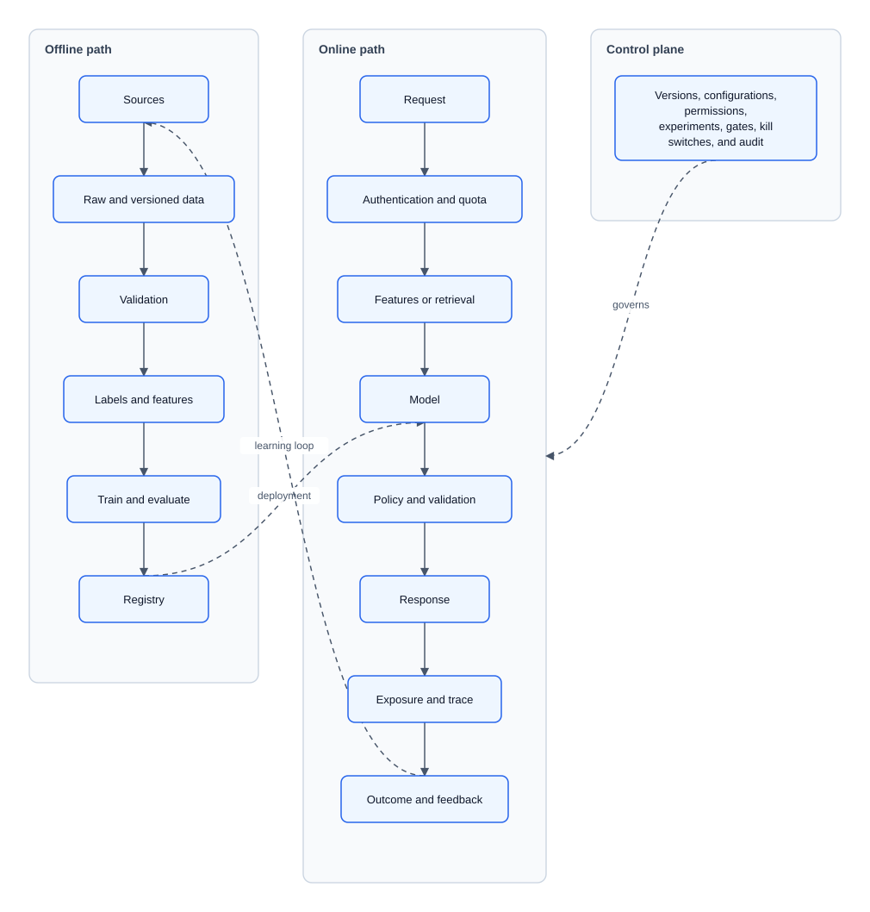
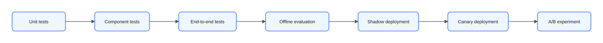
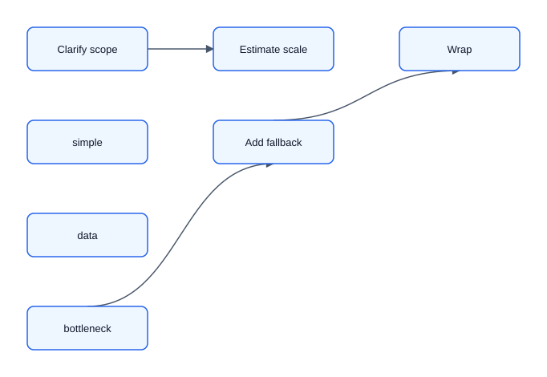

# 11 — Interview Cheat Sheet

Use this for the final review, not as a substitute for the full material.

## ByteByteGo-style flow

1. Requirements clarification
2. Capacity estimation
3. Create high-level design
4. Data design
5. Interface design
6. Scalability and performance
7. Reliability and resiliency

The interview loop is: understand the problem, propose the high-level design and get buy-in, deep dive on the riskiest pieces, then wrap up with trade-offs and next steps.

## Universal diagram



## Opening checklist

```text
User and action:
Functional requirements:
Non-functional requirements:
Input/output contract:
Primary metric and guardrails:
Current scale and next scale tier:
Data available at prediction/generation time:
Out of scope:
```

## Numbers

```text
QPS avg = requests/day ÷ 86,400
QPS peak = avg × 3-10
concurrency = QPS × latency_seconds
storage = records × bytes × replication
instances = peak load ÷ measured throughput ÷ 0.5-0.7 utilization
raw vector bytes = count × dimensions × bytes/value
LLM work ≈ QPS × (input + output tokens)
```

Always add index/metadata overhead, replicas, peak margin, and loss of one instance.

### Reference anchors

| Quantity | Order of magnitude |
|----------|--------------------|
| Bytes per parameter | fp32 = 4, fp16/bf16 = 2, int8 = 1, int4 = 0.5 |
| Weights (fp16) | 7B ≈ 14 GB, 13B ≈ 26 GB, 70B ≈ 140 GB |
| KV cache per token | `2 × layers × n_kv_heads × head_dim × bytes` (≈ 0.5 MB/tok for a 7B fp16) |
| Embedding dims | text 384-1536+, images 512-2048 |
| Typical LLM request | input 0.5k-4k tokens, output 100-1k tokens |

## Metrics

- Classification: PR-AUC for rare classes; recall at fixed precision; calibration; expected cost.
- Ranking: recall@K, MRR, NDCG, then A/B outcome.
- Regression/forecast: MAE/RMSE/quantile; bias; interval coverage; rolling backtest.
- RAG: retrieval recall@K + answer correctness/grounding/citations/abstention.
- System: semantic success, p95/p99, freshness, fallback, cost.
- Always segment and add safety/product guardrails.

## Data design

- What is the source of truth?
- What are the entity IDs and event IDs?
- What is the label, horizon, and maturity delay?
- Is every feature available at prediction time?
- What gets logged before outcome?
- What schemas, indexes, chunks, embeddings, and retention rules exist?
- How does deletion flow through raw data, features, indexes, caches, and artifacts?

## Interface design

```text
Request: identity/entity/context, auth scope, deadline, idempotency key
Response: score/ranking/answer/action proposal, confidence, reasons/citations
Events: exposure, decision, outcome, feedback, model/policy/index version
Errors: retryable, not retryable, partial result, unavailable
```

For tools and agents, typed schemas, least privilege, timeouts, idempotency, audit, and confirmation are part of the interface.

## Scalability and performance

- High read QPS: cache, replica, precompute, or approximate retrieval.
- High freshness: incremental update or stream only for the hot path that needs it.
- Large catalog/index: shard, compress, tier, or reduce candidate set.
- Tight latency: parallelize independent work, propagate deadlines, simplify model.
- High LLM cost: route, shorten context, cache, batch, distill, or go async.

## Evaluation and operations



- Versioned representative, hard, no-answer, and adversarial set.
- Rubric and human calibration; do not trust one LLM judge.
- Trace request to model/data/prompt/index/experiment.
- Monitor infrastructure, service, data/model, and semantic product quality.
- Alert = condition + impact + owner + runbook + mitigation.
- Rollback/kill switch, incident process, restore/failover test.

## Reliability and resiliency

- Timeout, retry, idempotency, circuit breaker, and bounded queue per dependency.
- Fallback ladder: current model → previous version → rules/search/cache/baseline → human or honest unavailability.
- Model-feature-policy compatibility and exact version logging.
- Canary, rollback, and kill switch before full launch.
- For high-impact actions, preview → explicit confirmation → idempotent execution.

## Security and responsible AI

- Assets, actors, attack surfaces, blast radius.
- Least privilege, isolation, provenance, signed artifacts, rate limits.
- Poisoning, evasion, extraction, injection, exfiltration, denial of wallet.
- Privacy minimization, consent, encryption, TTL/deletion.
- Fairness metric tied to defined harm; appeal and human review.
- Exact version and faithful explanation for high-risk decisions.

## Strong closing

> “The design starts with [simple baseline/core pattern] because it meets [requirements] at [estimated scale]. The key trade-offs are [quality vs. latency/cost] and [freshness/control vs. complexity]. The main bottleneck is [component]. It degrades to [fallback], is promoted through [evaluation/rollout], and I would add [next complexity] only when [measurable trigger].”

## If you get stuck



State an assumption, choose the simple option, explain why, and keep moving. A coherent simple design is stronger than a pile of impressive components.
